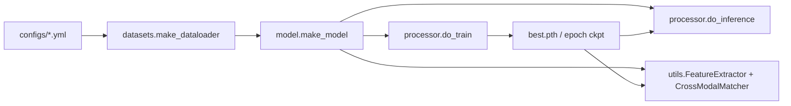

# SDF-Net 代码结构分析与跨模态特征匹配方案

## 1. 总体结构

SDF-Net 当前代码以 ReID 的常规四段式组织为主：

1. 配置层：`config/defaults.py` 和 `configs/*.yml` 定义模型、数据、输入尺寸、优化器、测试权重等参数。
2. 数据层：`datasets/` 负责 HOSS、Merged、Pretrain 数据集解析、图像读取、transform、collate、sampler。
3. 模型与损失层：`model/` 构建 ResNet 或 TransOSS Transformer；`loss/` 提供 softmax、triplet、结构一致性等监督。
4. 运行层：`train.py`、`train_pair.py`、`test.py`、`test_cross_modal.py` 组织训练、预训练/成对训练、常规测试、跨模态匹配测试。

主要数据流：



## 2. 入口脚本

`train.py`

- 读取配置、固定随机种子、初始化分布式训练。
- `make_dataloader(cfg)` 生成 train/val loader、类别数、camera 数。
- `make_model(cfg, num_class, camera_num)` 构建模型。
- `make_loss`、`make_optimizer`、`create_scheduler` 后调用 `processor.do_train`。

`train_pair.py`

- 调用 `make_dataloader_pair` 构造 RGB/SAR 成对数据。
- 训练入口为 `processor.do_train_pair`。
- 主要用于 `cfg.MODEL.PAIR=True` 的成对监督/预训练流程。

`pretrain.py`

- 独立于主框架的 timm ViT 对比学习预训练脚本。
- 从 `opt/` 与 `sar/` 文件夹按文件名前缀配对，用 InfoNCE 双向交叉熵训练共享 backbone。
- 路径、epoch、batch size 等目前硬编码，适合作为离线预训练工具，不是主训练链路。

`test.py`

- 原始 ReID 测试入口。
- 加载 `cfg.TEST.WEIGHT` 后调用 `processor.do_inference`。
- 原评估仍是按 query/gallery pid 做 CMC/mAP 排名评估。

`test_cross_modal.py`

- 已改造为标签无关的跨模态匹配测试入口。
- 默认流程：加载权重、提取归一化特征、无监督阈值校准、生成匹配矩阵、用测试标签仅做最终评价。

辅助数据脚本：

- `auto_data_router.py`、`append_mos_ship.py`、`rename_modality.py`、`check_data.py`、`check_pth.py` 用于数据整理、文件重命名、检查权重 key。
- 多个辅助脚本存在日志字符串编码损坏或截断，建议后续单独清理；它们不在主训练/跨模态测试闭环中。

## 3. 数据层

`datasets/make_dataloader.py`

- 训练 transform 包含 resize、flip、color jitter、padding、crop、normalize、random erasing。
- 测试 transform 为 resize、tensor、normalize。
- `train_collate_fn` 返回 `(img, pid, camid, viewid, img_size)`。
- `val_collate_fn` 返回 `(img, pids, camids, camids_batch, viewids, img_paths, img_size)`。
- 测试时 `val_set = query + gallery`，并用 `num_query` 切分特征。

`datasets/hoss.py`

- 适配 HOSS 标准 ReID 目录：`bounding_box_train`、`query`、`bounding_box_test`。
- 文件名首段作为 pid，后缀 `RGB.tif` 记为 camid 0，否则记为 SAR/camid 1。
- `_process_dir_train` 会构造 RGB-SAR pair。

`datasets/merged.py`

- 适配合并后的 opt/sar 数据。
- 训练集可从 `bounding_box_train/opt` 与 `bounding_box_train/sar` 读取。
- `_extract_pid` 解析 `id_s*c*_(opt|sar)`；不能解析时用 hash fallback。

`datasets/bases.py`

- `ImageDataset` 统一读取图像并返回归一化后的 `img_size` 辅助几何特征。
- SAR/灰度图最终转 RGB 输入模型。

## 4. 模型与核心算法

`model/make_model.py`

- 支持 ResNet50 和 Transformer，当前配置主要使用 `vit_base_patch16_224_TransOSS`。
- 推理阶段返回 BNNeck 后特征或原始全局特征，受 `cfg.TEST.NECK_FEAT` 控制。
- `build_transformer.load_param` 会跳过分类头和 `logit_scale`，这允许加载旧标签空间训练出的权重用于新数据集特征提取。

`model/backbones/vit_transoss.py`

- TransOSS 对 RGB 和 SAR 使用独立 patch embedding：`patch_embed` 与 `patch_embed_SAR`。
- MIE：当 `cfg.MODEL.MIE=True` 时加入 modality/camera embedding。
- SSE：当 `cfg.MODEL.SSE=True` 时加入图像宽高比例 embedding。
- Disentangle：启用后有 shared token 与 modality-specific token，推理可按 `sum/shared/specific/concat` 融合。
- 结构分支：在指定 Transformer block 后取 patch token，计算水平/垂直梯度能量，形成 `f_struct`。

`loss/`

- `make_loss.py` 根据 sampler 组合交叉熵和 triplet。
- `structure_loss.py` 用同 pid 的 RGB/SAR 结构特征中心做 MSE，鼓励跨模态结构一致。
- `triplet_loss.py` 使用 hard example mining。

## 5. 训练与原始测试流程

训练：

1. dataloader 输出图像、pid、camid、img_wh。
2. 模型训练态输出分类分数、特征、结构特征。
3. loss 由 ID loss、triplet loss、可选结构一致性 loss、可选正交约束组成。
4. 周期性在 val loader 上提特征，按 pid 计算 CMC/mAP，并保存 best.pth。

原始测试：

1. `processor.do_inference` 对 query+gallery 提取特征。
2. `R1_mAP_eval.compute` 按 `num_query` 切分 qf/gf。
3. 计算欧氏距离矩阵。
4. 用测试 pid 判断排序是否正确。

原始流程的问题是：普通 ReID 评估本身可用测试 pid 作为 ground truth，但不能把测试 pid 用来拟合 matcher 或阈值，否则训练集/测试集标签空间不一致时会泄漏测试标签。

## 6. 本次改造

修改文件：

- `utils/feature_extractor.py`
- `utils/distance_metrics.py`
- `utils/classifier.py`
- `utils/cross_modal_matching.py`
- `utils/progress_bar.py`
- `test_cross_modal.py`

关键变化：

1. 独立特征提取框架
   - `FeatureExtractor` 构建 SDF-Net 并加载预训练/训练权重。
   - 分类头类别数不再依赖训练集实际类别，推理仅取 embedding。
   - 输出默认 L2 归一化特征，增强尺度鲁棒性。

2. 标签无关 matcher
   - 默认 `cosine_distance`。
   - 默认 `threshold_strategy=mad`，只基于 query 到 gallery 的最近邻距离分布校准阈值。
   - 支持 `percentile`、`otsu`、`manual`。
   - 支持 `--require_mutual` 仅保留 mutual top-1 匹配，减少一对多误匹配。
   - 非阈值分类器仍保留，但必须显式传 `--supervised_matcher`，作为 ablation 使用。

3. 测试流程优化
   - `test_cross_modal.py` 不再默认用 q/g pid 训练阈值。
   - pid 只用于最终计算 precision/recall/F1、CMC/mAP。
   - 保存 `metric_matrix.npy`、`distance_matrix.npy`、`match_matrix.npy`、`top_matches.csv`、`metrics.json`。

## 7. 自适应阈值算法

推荐默认方案：L2 normalization + cosine distance + nearest-neighbor MAD threshold。

令 query 特征为 `Q`，gallery 特征为 `G`，归一化后：

```text
D_ij = 1 - cosine(q_i, g_j)
b_i = min_j D_ij
theta = median(b) + lambda * 1.4826 * MAD(b)
match(q_i, g_j) = D_ij <= theta
```

其中 `lambda` 对应 `--threshold_mad_scale`，默认 3.0。

优点：

- 不依赖训练集或测试集标签。
- cosine distance 对特征尺度变化不敏感。
- MAD 比均值/方差更抗离群 query。
- 只需一次矩阵乘法和一次行最小值，计算成本低。

备选：

- Percentile：`theta = percentile(b, p)`，适合希望控制匹配覆盖率的场景。
- Otsu：对最近邻距离直方图做类间方差最大化，适合距离分布呈双峰时。
- Manual：已有验证集经验阈值时直接指定。
- Mutual top-1：在阈值基础上要求 query 的最佳 gallery 与 gallery 的最佳 query 互相指向。

## 8. 潜在优化方向

准确率方向：

- 使用独立验证集校准阈值，不使用测试标签。
- 做 query/gallery 按模态或场景的分组阈值，解决不同传感器域差异。
- 对特征做 PCA/whitening 或 domain-specific BN。
- 在排名评估后加入 k-reciprocal re-ranking，但要注意大规模矩阵内存。

效率方向：

- 大规模测试时对距离矩阵分块计算并保存 top-k，避免完整 `Nq x Ng` 常驻内存。
- 引入 FAISS/ANN 做近邻检索。
- 对 manhattan/chebyshev/minkowski 避免一次性构建三维差分张量，改为 chunk 计算。

工程方向：

- 修复辅助数据脚本的编码损坏和硬编码路径。
- 将数据路径、预训练路径、输出路径全部配置化。
- 给 `test_cross_modal.py` 增加小型 synthetic test，验证 similarity/distance 方向、阈值策略和 top-k 保存。

## 9. 推荐运行方式

默认无标签泄漏测试：

```bash
python test_cross_modal.py --config_file configs/SDF-Net_Test.yml
```

更保守的 mutual top-1：

```bash
python test_cross_modal.py --config_file configs/SDF-Net_Test.yml --require_mutual
```

比较多种距离：

```bash
python test_cross_modal.py --config_file configs/SDF-Net_Test.yml --compare_metrics
```

手动阈值：

```bash
python test_cross_modal.py --config_file configs/SDF-Net_Test.yml --threshold_strategy manual --manual_threshold 0.35
```
